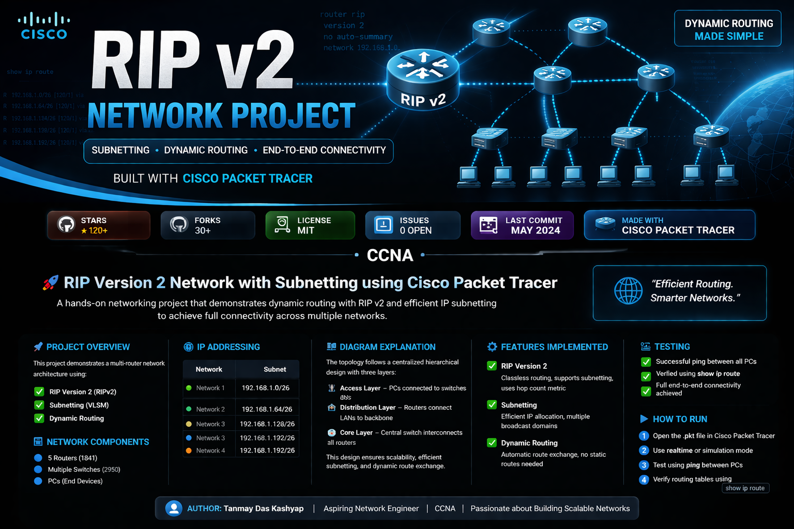

# RIP Version 2 Network with Subnetting using Cisco Packet Tracer

## 📌 Project Overview

This project demonstrates a multi-router network architecture using:

* RIP Version 2 (RIPv2)
* Subnetting (VLSM)
* Dynamic Routing

## 🧱 Network Components

* 5 Routers (1841)
* Multiple Switches (2950)
* PCs (End Devices)

## 🌐 IP Addressing

* Network 1: 192.168.1.0 /26
* Network 2: 192.168.1.64 /26
* Network 3: 192.168.1.128 /26
* Network 4: 192.168.1.192 /26

**The topology follows a **centralized hierarchical design**:

* A **core layer (central switch/network)** connects all routers
* Each router connects to a **separate LAN via a switch**
* Each LAN belongs to a different subnet using /26

### 🔹 Structure Breakdown

* **Access Layer:**
  - PCs connected to switches
  - Represents end-user networks

* **Distribution Layer:**
  - Routers connecting LANs to the backbone
  - Responsible for routing decisions

* **Core Layer:**
  - Central connection point for all routers
  - Ensures inter-network communication

### 🔹 Data Flow Example

1. PC sends data to another subnet  
2. Packet goes to default gateway (router)  
3. Router checks RIP v2 routing table  
4. Packet travels through core network  
5. Delivered to destination network  

### 🔹 Why This Design?

* Scalable network structure  
* Efficient subnetting  
* Dynamic routing instead of static configuration  

---

## ⚙️ Features Implemented

### 🔹 RIP Version 2

* Classless routing protocol  
* Supports subnetting  
* Uses hop count metric  

### 🔹 Subnetting

* Efficient IP allocation  
* Multiple broadcast domains  

### 🔹 Dynamic Routing

* Automatic route exchange  
* No manual static routes needed  

---

## 🧪 Testing

* Successful ping between all PCs  
* Verified using `show ip route`  
* Full connectivity achieved  

---

## ▶️ How to Run

1. Open the `.pkt` file in Cisco Packet Tracer  
2. Use realtime or simulation mode  
3. Test using ping  
4. Verify routing tables  

---

## 📜 License

This project is licensed under the MIT License.

---

## 👨‍💻 Author

Tanmay Das Kashyap
